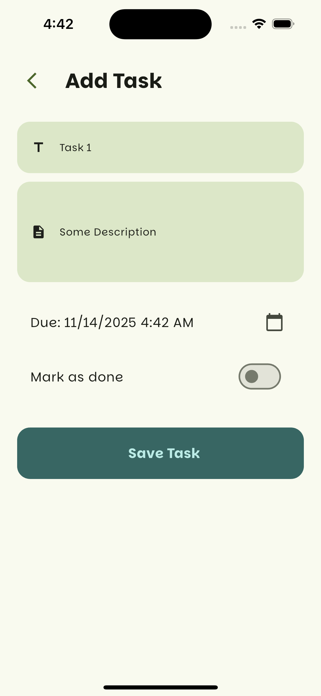

# 📱 My Tasks App

A Flutter application for managing daily tasks efficiently — featuring authentication, file/image attachments, and organized task lists.  
Built with **Flutter**, **Firebase**, and **BLoC state management**, following clean architecture principles.

---

## Screenshots

<p align="center">
  
</p>




## 🚀 Features

- 🔐 **User Authentication** (Firebase Auth)  
- 🗂️ **Task Management** – Add, edit, delete, and complete tasks  
- 📎 **Attach files or images** to tasks using `image_picker` and `file_picker`  
- ☁️ **Cloud Storage** with Firebase Firestore  
- 🌙 **Dark & Light Theme Support**  
- 📱 Responsive UI for Android and iOS  

---

## 🧰 Tech Stack

- **Flutter SDK** (>=3.0.0)  
- **Dart**  
- **BLoC (flutter_bloc)** – for state management  
- **get_it**
- **Firebase Auth & Firestore**  
- **flutter_slidable**
- **image_picker**  
- **file_picker**  

---

## 🛠️ Setup Instructions

### 1️⃣ Clone the Project
```bash
git clone https://github.com/your-username/my_tasks.git
cd my_tasks

```

### 2️⃣ Install Dependencies
```bash
flutter pub get
```

### 3️⃣ Configure Firebase

1. Go to the [Firebase Console](https://console.firebase.google.com/).
2. Create a new project.
3. Add Android and iOS apps to your Firebase project.
4. Download and place these config files:
   - `google-services.json` → inside `android/app/`
   - `GoogleService-Info.plist` → inside `ios/Runner/`
5. Run the FlutterFire CLI to connect Firebase:
   ```bash
   flutterfire configure
   ```

### 4️⃣ Run the App
```bash
flutter run
```

---

## 📄 License
This project is open-source and available under the [MIT License](LICENSE).
